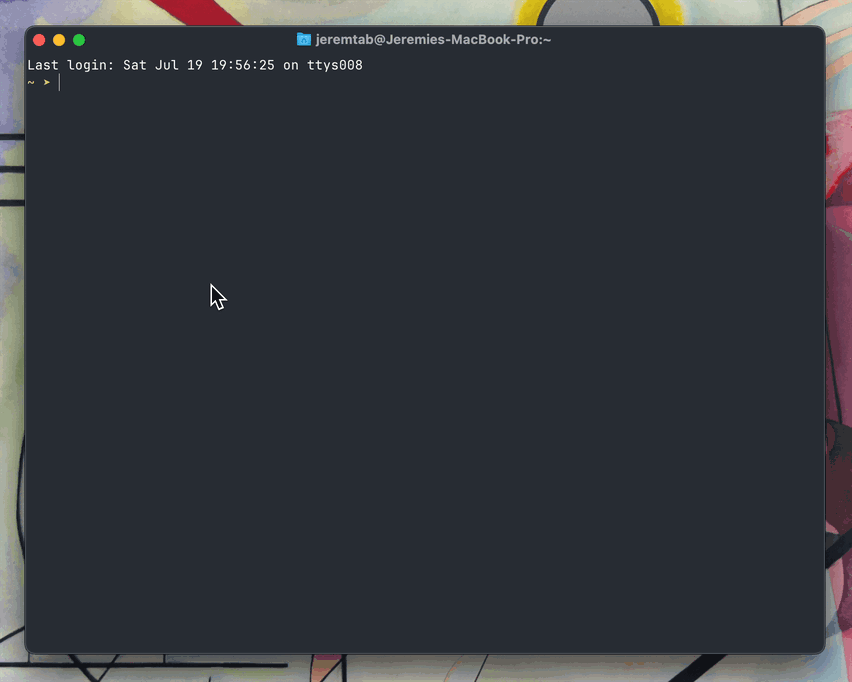

# Trailers CLI

Simple CLI to quickly get all trailers of movies currently in theater using TMDB api.



## Setup

1. Install dependencies:

```zsh
npm install
```

2. Copy the environment file and configure:

```zsh
cp .env.example .env
```

3. Edit `.env` with your configuration values.
   a. Create account here: https://www.themoviedb.org/signup
   b. Get your api key here: https://www.themoviedb.org/settings/api (use the small one at the bottom)

## Development

Run in development mode:

```zsh
npm run dev
```

## Build and Install

Build the TypeScript to JavaScript:

```zsh
npm run build
```

Install globally to use the `trailers` command:

```zsh
npm run install-global
```

Add your API key to your global env, for instance if your using zsh:

```zsh
echo 'export TMDB_API_KEY=your_api_key_here' >> ~/.zshrc
```

Now you can use the CLI anywhere:

```zsh
trailers
```

## Uninstall

To uninstall the global command:

```zsh
npm run uninstall-global
```
